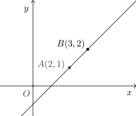

# 10.1.1 直线的倾斜角和斜率

在平面直角坐标系中, 点 $A(2,1)$, $B(3,2)$, 如何确定直线 $AB$ 的方程, 即如何得到直线 $AB$ 上任意点 $(x,y)$ 满足的等式?

按初中数学的解法, 因为直线 $AB$ 可用一次函数 $y= kx+b$ 来描述, 所以将点 $A(2,1)$, $B(3,2)$ 代入, \[
    \left\{\!\!\begin{array}{l}
        1= 2k+b,\\
        2= 3k+b,
    \end{array}\right.\quad\text{解得}\quad
    \left\{\!\!\begin{array}{l}
        k= 1,\\
        b= -1,
    \end{array}\right.\]
所求方程为 $y= x-1$.

平面直角坐标系中的直线的斜率定义为其上两点间纵坐标与横坐标增量的比值. 具体地说, 设直线 $l$ 上有两点 $A(x_A,y_A)$,$B(x_B,y_B)$, 
  则 $l$ 的斜率 
  \[k=\dfrac{y_A-y_B}{x_A-x_B}.\]
  从定义可知, 竖直的直线没有斜率 (或斜率为 $\infty$),
  且斜率为正表示直线对应的函数单调增, 而斜率为负则表示直线对应的函数单调减.
  直线的倾斜角定义为直线向上的方向与 $x$ 轴正向的夹角, 
  取值范围是 $[0^\circ,180^\circ)$. 设直线 $l$ 斜率为 $k$, 倾斜角为 $\alpha$,
  则由正切和斜率定义可知 $k=\tan\alpha$.
  
