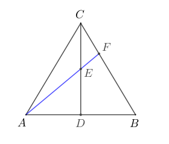

# 直线与圆

初中数学已经介绍了直线与圆的相关概念, 也指出一次函数 (如 $y=x+1$) 的图形是直线. 高中数学将学习在平面直角坐标系中直线与圆的表示方法, 即利用图形上点 $(x,y)$ 的特征来表示直线与圆. 这些特征一般用含 $x$, $y$ 的等式描述, 并称为对应图形的方程.

有了图形的方程, 就可以利用代数方法来研究图形之间的关系, 这也是解析几何的主要研究方法. 直线与圆的方程是解析几何的入门内容. 初中数学有些几何题利用图形的方程可以更容易解决. 这里的“容易”指的是解题思路更程序化, 同一解题思路对多种题型都有效, 无需针对不同的题型采用不同的解题思路. 现举一例说明.

<myexample>
    
在 $\triangle ABC$ 中, $AC=BC$, 点 $D$ 为 $AB$ 中点, 点 $E$ 为 $CD$ 中点, $AE$ 交 $BC$ 于点 $F$, 求证: $BF= 2FC$.

</myexample>

<myremark>
    
这个例子中的条件“$AC=BC$”是多余的, 保留该条件是为了让代数法的解题过程更容易理解 (见这里(补链接)). 去掉条件“$AC=BC$”后, 代数法仍适用 (见这里(补链接)).

</myremark>

上面这个例子的初中几何解法是: 过点 $D$ 作 $DG\parallel BC$ 交 $AF$ 于点 $G$, 则可证明 $BF= 2DG$, $CF=DG$, 所以 $BF= 2FC$. 这个解法看似很简洁, 但问题是有时不容易想到辅助线的作法. 若将这个图置于平面直角坐标系内, 则可以通过直接计算直线 $AF$ 与 $BC$ 的坐标来确认点 $F$ 的位置, 无需花费心思琢磨如何添加辅助线.

解析几何的首要任务是用方程表示图形, 因此需要适当地描述图形的特征, 然后将该特征用点的坐标来表示, 这个过程也称为解析法. 对同一图形有时会有不同的描述方法, 比如线段 $AB$ 的中垂线 $CD$ 可以描述为

1. (中垂线的定义) 过线段 $AB$ 的中点且与 $AB$ 垂直的直线;
2. (中垂线的性质) 到点 $A$,$B$ 的距离相等的所有点.

由上述两种不同的描述方法可以得到看似不同的方程 (变形后一致), 计算量也有区别. 运用解析法解决问题时, 常常需要选择适当的描述图形的方法. 此外, 描述图形的特征时, 常常用到两点之间的距离和中点, 在学习后面的内容之前必须熟悉在平面直角坐标系中的相关结论 (见 [数轴与平面直角坐标系](../../prerequisite/ms-function/axis-coordinate)).

本章目录为

- [10.1 直线的方程](./10-1-line)
- 10.2 圆的方程
- 10.3 直线与圆的位置关系
- 10.4 圆与圆的位置关系 (选学)
