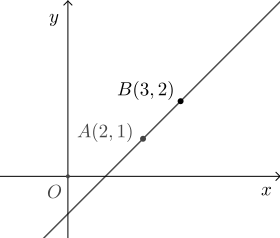

# 10.1 直线的方程

在平面直角坐标系中, 点 $A(2,1)$, $B(3,2)$, 如何确定直线 $AB$ 的方程, 即如何得到直线 $AB$ 上任意点 $(x,y)$ 满足的等式?

按初中数学的解法, 因为直线 $AB$ 可用一次函数 $y= kx+b$ 来描述, 所以将点 $A(2,1)$, $B(3,2)$ 代入, \[
    \left\{\!\!\begin{array}{l}
        1= 2k+b,\\
        2= 3k+b,
    \end{array}\right.\quad\text{解得}\quad
    \left\{\!\!\begin{array}{l}
        k= 1,\\
        b= -1,
    \end{array}\right.\]
所求方程为 $y= x-1$.

上述解法至少有如下缺点:

- 必须先知道图形的方程才能确定其中的系数, 而很多图形的方程事先是不知道的, 比如后面将要学习的圆、椭圆、双曲线等;
- 一次函数的图形不能与 $x$ 轴垂直, 即与 $x$ 轴垂直的直线方程无法用上述解法确定.

由于这两个缺点, 上述解法没有通用性, 自然也不是解析法. 用解析法得到图形 $G$ 的方程的步骤是

1. 确定图形 $G$ 上点 $(x,y)$ 的特征 (通常是点满足的充要条件);
2. 将点的特征表示为含 $x$,$y$ 的方程;
3. 适当化简方程, 如化为 $F(x,y)=0$ 的形式;
4. 检验满足方程 $F(x,y)=0$ 的点都在图形 $G$ 上 (通常可省略这一步).

四个步骤中, 最重要的是第一步. 只有确定了图形上点的特征, 才能顺利得到图形的方程. 本节先介绍直线的特征, 然后引入直线的方程, 并考察两条直线平行或垂直时, 它们的方程的特点. 

本节目录为

- [10.1.1 直线的倾斜角和斜率](./10-1-1-slope)
- 10.1.2 直线的方程
- 10.1.3 两条直线的平行与垂直
- 10.1.4 直线的参数方程与点法式方程 (选学)

<!-- 平面直角坐标系中的直线的斜率定义为其上两点间纵坐标与横坐标增量的比值. 具体地说, 设直线 $l$ 上有两点 $A(x_A,y_A)$,$B(x_B,y_B)$, 
  则 $l$ 的斜率 
  \[k=\dfrac{y_A-y_B}{x_A-x_B}.\]
  从定义可知, 竖直的直线没有斜率 (或斜率为 $\infty$),
  且斜率为正表示直线对应的函数单调增, 而斜率为负则表示直线对应的函数单调减.
  直线的倾斜角定义为直线向上的方向与 $x$ 轴正向的夹角, 
  取值范围是 $[0^\circ,180^\circ)$. 设直线 $l$ 斜率为 $k$, 倾斜角为 $\alpha$,
  则由正切和斜率定义可知 $k=\tan\alpha$.
  
  直线与 $x$~轴交点的横坐标为直线的横截距, 类似地可定义纵截距. 
  注意, 截距是坐标而不是距离, 所以取值可正可负.
  如直线 $y=x+1$ 的横截距为 $-1$, 纵截距为 $1$, 
  而说直线 $l$ 的横截距为 $3$, 纵截距为 $2$ 是指 $l$ 过点 $(3,0)$ 和 $(0,2)$.
  
  两点确定一条直线, 所以确定直线通常需要两个条件. 直线方程常见的形式如下:
  \begin{align*}
    &\text{点斜式:\ }y-y_0=k(x-x_0),\quad
     \text{斜截式:\ }y=kx+b,   \\
    &\text{两点式:\ }y-y_1=\frac{y_2-y_1}{x_2-x_1}(x-x_1),\quad
     \text{一般式:\ }Ax+By+C=0.
  \end{align*}
  前三种方程由于使用了斜率, 所以无法表示竖直的直线, 
  其中斜截式和两点式都可以看成点斜式的特例. 
  显然, 前三种方程都可以写成一般式. 当 $B\neq0$ 时, 
  一般式可写成斜截式 $y=-\dfrac{A}{B}x-\dfrac{C}B$, 从而可知其斜率和纵截距. -->
