# 1.3.4 函数图形的变换

研究函数图形的变换时, 应考虑的是其上点坐标的变换, 并利用原函数图形解析式表示新函数图形解析式.

## 平移

一次函数 $y=x$ 的图形是第一、三象限的角平分线, 将其向右平移 $1$ 个单位长度后, 新图形过点 $(1,0)$ 和 $(0,-1)$, 所以得到 $y=x-1$ 的图形. 同样分析可知, 将 $y=x$ 的图形向左平移 $1$ 个单位长度后, 得到 $y=x+1$ 的图形.

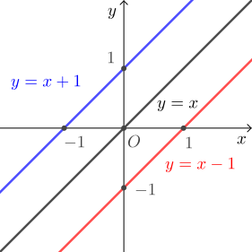

二次函数 $y=x^2$ 的图形是开口向上、顶点为原点且对称轴为 $y$ 轴的抛物线, 将其向右平移 $1$ 个单位长度后, 新图形仍为开口向上的抛物线, 且顶点为 $(1,0)$、对称轴为直线 $x=1$, 所以解析式为 $y=(x-1)^2$. 类似地, 将二次函数 $y=x^2$ 的图形其向左平移 $1$ 个单位长度后, 得到 $y=(x+1)^2$ 的图形.

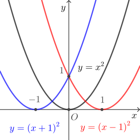

设 $a>0$, 从上面两个例子可知, 将函数图形向右平移 $a$ 个单位长度, 就是将解析式中的 $x$ 换成 $x-a$; 将函数图形向左平移 $a$ 个单位长度, 就是将解析式中的 $x$ 换成 $x+a$. 有时也将此结论简记为“左加右减”.

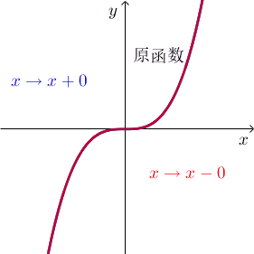

对比一次函数 $y= 2x$, $y=2x+1$ 和 $y=2x-1$ 的图形可知, 将 $y= 2x$ 的图形向上平移 $1$ 个单位长度可得 $y=2x+1$ 的图形, 向下平移 $1$ 个单位长度可得 $y=2x-1$ 的图形. 再比如, 将二次函数 $y= x^2$ 的图形向上平移 $1$ 个单位长度可得 $y=x^2+1$ 的图形, 向下平移 $1$ 个单位长度可得 $y=x^2-1$ 的图形.

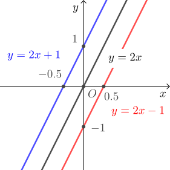

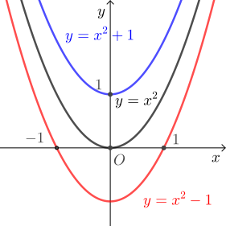

设 $b>0$, 由上述例子可知, 将函数图形向上平移 $b$ 个单位长度, 就是将解析式整体加上 $a$; 将函数图形向下平移 $b$ 个单位长度, 就是将解析式整体减去 $b$. 有时也将此结论简记为“上加下减”.

## 对称

考虑一次函数 $y=x+1$ 和 $y= -(x+1)$ 可知, 对相同的 $x$, 前者与后者的 $y$ 值互为相反数, 所以图形上的对应点关于 $x$ 轴对称, 也即两个图形关于 $x$ 轴对称. 再比如二次函数 $y= x^2$ 和 $y=-x^2$ 的图形也关于 $x$ 轴对称. 所以对函数解析式整体添负号 (即 $y$ 变成相反数) 等价于将图形关于 $x$ 轴作对称图形.

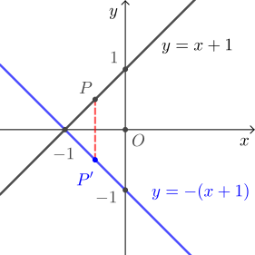

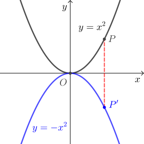

再考虑一次函数 $y=2x+1$ 和 $y= -2x+1$ 可知, 当前者与后者的 $x$ 互为相反数时可得到相同的 $y$, 所以图形上的对应点关于 $y$ 轴对称, 也即两个图形关于 $y$ 轴对称. 再比如二次函数 $y= x^2+x$ 和 $y=x^2-x= (-x)^2+(-x)$ 的图形也关于 $y$ 轴对称. 所以将函数解析式中的 $x$ 换为 $-x$ 等价于将图形关于 $y$ 轴作对称图形.

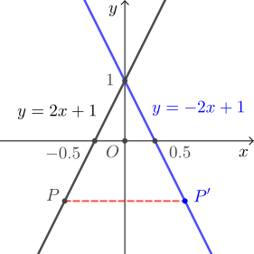

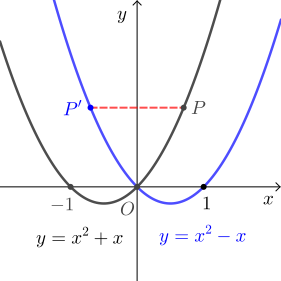

最后考虑函数 $y=x+1$ 和 $y= |x+1|$ 可知, 对相同的 $x$, 后者的 $y$ 值是前者的 $y$ 值的绝对值, 体现在图形上就是将前者图形上在 $x$ 轴下方的点 (对应的 $y<0$)“翻折”(关于 $x$ 轴作对称) 到 $x$ 轴上方, 而原本在 $x$ 轴上和上方的点保持不变. 类似地, 可由函数 $y= x^2+x$ 的图形作出函数 $y= |x^2+x|$ 的图形.

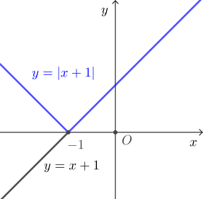

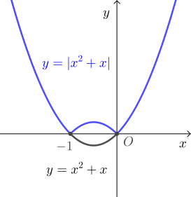
